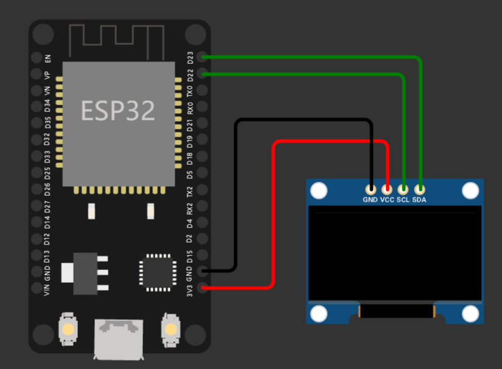

# AtomUI
A simple UI framework based on u8g2 for monochrome screen.

# Try on esp32 Arduino
You need a ssd1306 oled display.  
First install u8g2 library in Arduino IDE, then copy `main.cpp` content to Arduino IDE.
Wiring like this.

# Try on Windows
1. 装好 [msys2](https://www.msys2.org/) 环境
2. （可选）使用 msys2-mingw64 执行`sed -i "s#mirror.msys2.org/#mirrors.tuna.tsinghua.edu.cn/msys2/#g" /etc/pacman.d/mirrorlist*`切换国内源
3. 使用 msys2-mingw64 执行`pacman -S mingw-w64-x86_64-SDL2`，安装SDL2
4. 使用 msys2-mingw64 执行`pacman -S mingw-w64-x86_64-toolchain cmake make git`，安装编译器等
5. `cmake -B build`
6. `cd build && make`
7. `./atomUI.exe`

# Try it on Wokwi 
https://wokwi.com/projects/369415950887493633